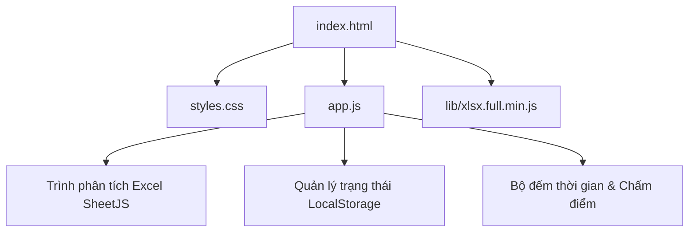

# Kế hoạch phát triển: Công cụ ôn luyện trắc nghiệm (Quiz Practice Tool)

Dự án này nhằm xây dựng một ứng dụng web chạy hoàn toàn trên trình duyệt (Single Page Application - SPA) giúp người dùng ôn luyện khoảng 1500 câu hỏi trắc nghiệm từ file Excel có sẵn. Công cụ sẽ hỗ trợ cả hai chế độ: Luyện tập tự do (Study Mode) và Thi thử tính giờ (Exam Mode) kèm chấm điểm tự động.

## User Review Required

> [!IMPORTANT]
> **Định dạng file Excel và Ánh xạ cột (Column Mapping):**
> Do cấu trúc file Excel của mỗi người có thể khác nhau (tên cột khác nhau, số lượng đáp án khác nhau), ứng dụng sẽ tích hợp một **Trình hướng dẫn ánh xạ cột (Column Mapping Wizard)**.
> - Khi tải file Excel lên lần đầu, ứng dụng sẽ quét các cột và hiển thị giao diện cho phép bạn chọn cột nào là "Câu hỏi", các cột nào là "Đáp án (A, B, C, D...)", cột nào là "Đáp án đúng", và cột nào là "Giải thích" (nếu có).
> - Cấu hình này sẽ được lưu lại để các lần sau không cần ánh xạ lại.

> [!TIP]
> **Hoạt động Ngoại tuyến (Offline-First):**
> Ứng dụng sử dụng thư viện **SheetJS (xlsx.full.min.js)** được tải trực tiếp từ thư mục cục bộ (đã tải về máy) để phân tích file Excel mà không cần gửi dữ liệu lên máy chủ. Mọi dữ liệu câu hỏi, tiến độ ôn tập và kết quả thi sẽ được lưu trữ an toàn trong `localStorage` / `IndexedDB` của trình duyệt. Bạn có thể sử dụng công cụ này ngay cả khi không có kết nối Internet.

## Proposed Changes

Chúng ta sẽ tạo một cấu trúc thư mục sạch sẽ và tự chứa trong thư mục scratch của dự án:
`/home/mynnt/.gemini/antigravity-ide/scratch/quiz-app/`



---

### [Component: Quiz Application]

Tất cả mã nguồn ứng dụng sẽ được lưu trữ tại thư mục `quiz-app`.

#### [NEW] [index.html](file:///home/mynnt/.gemini/antigravity-ide/scratch/quiz-app/index.html)
- Khung cấu trúc HTML5 chuẩn SEO.
- Sử dụng các thẻ ngữ nghĩa: `<header>`, `<main>`, `<section>`, `<footer>`, `<aside>`.
- Giao diện dạng SPA gồm các màn hình chính (quản lý bằng việc ẩn/hiện CSS):
  1. **Màn hình Tải file (Upload Screen)**: Nơi kéo thả file Excel, hiển thị bảng ánh xạ cột nếu cần, tải câu hỏi mẫu.
  2. **Bảng điều khiển (Dashboard Screen)**: Hiển thị tổng quan số câu hỏi, tiến độ ôn tập (số câu đã làm, số câu đúng/sai), các nút để vào chế độ Luyện tập hoặc Thi thử.
  3. **Chế độ Luyện tập (Study Mode Screen)**: Hiển thị từng câu hỏi, cho phép chọn đáp án và xem kết quả đúng/sai ngay lập tức, lưu câu hỏi yêu thích (Star), hiển thị giải thích chi tiết.
  4. **Chế độ Thi thử (Exam Mode Screen)**: Hiển thị đồng hồ đếm ngược, danh sách các câu hỏi để chuyển nhanh (Question Grid), nộp bài thi.
  5. **Màn hình Kết quả (Results Screen)**: Biểu đồ kết quả dạng vòng tròn (chấm điểm), thống kê thời gian làm bài, danh sách câu trả lời đúng/sai để xem lại.

#### [NEW] [styles.css](file:///home/mynnt/.gemini/antigravity-ide/scratch/quiz-app/styles.css)
- Xây dựng hệ thống thiết kế (Design System) hiện đại:
  - Phối màu: Sử dụng hệ màu HSL mượt mà, chủ đạo là màu Indigo/Blue cao cấp cho chủ đề sáng và tối.
  - Hỗ trợ chế độ Sáng/Tối (Light/Dark mode) tự động dựa trên hệ điều hành hoặc chuyển đổi thủ công.
  - Phông chữ hiện đại: Sử dụng font `Outfit` hoặc `Inter` tải từ Google Fonts.
  - Bo góc mềm mại, đổ bóng sâu (subtle shadows), hiệu ứng làm mờ kính (glassmorphism) cho các hộp thoại.
- Hoạt ảnh sinh động (Micro-animations):
  - Hiệu ứng hover mượt mà cho các nút đáp án trắc nghiệm.
  - Trạng thái chọn đáp án và hiệu ứng đúng/sai (xanh lá/đỏ) với các icon động sinh động.
  - Đồng hồ đếm giờ có hiệu ứng nhấp nháy đỏ khi thời gian còn dưới 5 phút.
  - Thanh tiến độ (Progress bar) chạy mượt mà.
- Thiết kế đáp ứng (Responsive Design): Hoạt động hoàn hảo trên cả máy tính và điện thoại di động.

#### [NEW] [app.js](file:///home/mynnt/.gemini/antigravity-ide/scratch/quiz-app/app.js)
- **Bộ máy xử lý File Excel**: Đọc file bằng SheetJS, hỗ trợ tự động nhận diện tiêu đề cột thông minh và giao diện ánh xạ thủ công.
- **Quản lý Trạng thái (State Management)**:
  - Quản lý danh sách câu hỏi, câu hỏi đã đánh dấu sao (starred), các câu hỏi thường trả lời sai.
  - Lưu trữ lịch sử thi thử và tiến độ ôn tập vào `localStorage`.
- **Chế độ Luyện tập**:
  - Hỗ trợ lọc câu hỏi: Tất cả, Chưa làm, Làm sai, Đã đánh dấu sao.
  - Hiển thị phản hồi đúng/sai lập tức khi click chọn đáp án.
  - Hỗ trợ phím tắt bàn phím (1, 2, 3, 4 hoặc A, B, C, D để chọn; Mũi tên trái/phải để chuyển câu hỏi).
- **Chế độ Thi thử**:
  - Tạo đề thi ngẫu nhiên từ kho câu hỏi (cho phép chọn số lượng câu hỏi và thời gian thi).
  - Bộ đếm thời gian chính xác (sử dụng `setInterval`).
  - Hộp thoại cảnh báo khi nộp bài mà còn câu hỏi chưa trả lời.
- **Chế độ Chấm điểm**:
  - Tính điểm dựa trên số câu đúng, hiển thị phần trăm chính xác.
  - Phân loại câu hỏi thành đúng, sai, chưa làm để xem lại chi tiết.
- **Hệ thống tạo hạt Confetti**: Viết bằng Canvas để bắn pháo hoa ăn mừng khi người dùng đạt điểm thi thử cao mà không cần cài thêm thư viện ngoài.

## Verification Plan

### Automated Tests
Vì là ứng dụng frontend thuần chạy trên trình duyệt không có môi trường node để chạy test runner phức tạp, chúng ta sẽ viết các hàm tự kiểm thử (Self-tests) tích hợp trong `app.js` (hoạt động ở chế độ development hoặc truy cập qua Console):
- Hàm `runUnitTests()` để kiểm thử logic tính điểm, logic đếm thời gian, và hàm chuẩn hóa đáp án đúng.

### Manual Verification
1. Mở ứng dụng trong trình duyệt bằng cách chạy máy chủ static Python:
   ```bash
   python3 -m http.server -d /home/mynnt/.gemini/antigravity-ide/scratch/quiz-app 8000
   ```
2. Mở trình duyệt truy cập `http://localhost:8000`.
3. Kiểm tra tính năng tải câu hỏi mẫu (Sample Data) để kiểm tra giao diện ôn luyện và thi thử trước khi tải file thực tế.
4. Tải một file Excel kiểm thử (sẽ tự tạo một file Excel test nhỏ để xác minh) để chạy thử trình ánh xạ cột.
5. Thực hiện làm bài thi thử, kiểm tra bộ đếm giờ hoạt động chính xác, nộp bài và kiểm tra màn hình chấm điểm.
6. Xác minh hoạt động của chế độ tối (Dark mode) và độ phản hồi trên các kích thước màn hình khác nhau.
